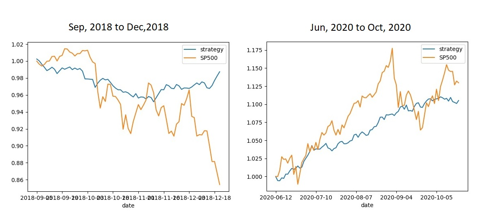

## Stock price prediction using tweet sentiment analysis
Historical tweet data is a treasure trove of opinions on variety of subjects including stock price movements. Whilst financial twitter and stock prices often react to each other in real time, institutional investors sometimes react in longer time-frames as it takes time to process all the new information and for them, the flow of funds is in huge sizes and therefore, commissions paid are quite large.  
The hypothesis is that **some trading decisions/trends on the next day will be implicit in the average tweet sentiment data on a given day.** To test the hypothesis, this algorithm makes predictions on [beta](https://www.investopedia.com/terms/b/beta.asp)-hedged returns on [S&P100](https://en.wikipedia.org/wiki/S%26P_100) stocks using average tweet sentiment, volumes traded and beta-hedged returns for the previous day for each individual stock. Any return generated with such a trading strategy will be uncorrelated to the index return (I used S&P500 as the benchmark) as each position is beta-hedged. It is a relative value strategy.

## How it works
We train and test the prediction algorithm with following steps-
1. **Scraping raw tweets:** Cashtags were used as the search keyword to scrape tweets relevant to each stock. For example, cashtag for Apple is $AAPL. 'Apple' would have been too generic a search keyword and would return a very large number of irrelevant tweets. Tweets from Sep, 2018 to Oct,2020 were scraped. The algorithm would be trained on Jan, 2019 to May,2020 dataset and will be tested on Sep, 2018 to Dec,2018 and Jun, 2020 to Oct, 2020 datasets.
2. **Cleaning tweets:** Hyperlinks and special characters were removed from each tweet. Tweets containing more than five cashtags were considered spam and removed and duplicate tweets, if any, were removed. 
3. **Sentiment analysis:** Sentiment score of each tweet was calculated using VADER sentiment analyzer. Average sentiment score was calculated for all tweets for each stock in each open-open period. For example, NYSE opens for trading on December 1, 2020 at 9:30 AM EST, so, for return prediction for this date, the algorithm will compute average sentiment score from 9:30 AM on November 30, 2020 (the previous open) to 9 AM EST on December 1, 2020 (half an hour before current open). The half hour buffer allows time for the algorithm to run and generate predicitons by the opening time.
4. **Training data compilation:** The above data was combined with traded volumes and beta-hedged returns for each stock. Change in average sentiment from the previous day was also calculated. Using the next day return, the stock classification was also generated as one of the following:
    * Strong buy: 2 if next-day beta-hedged return >= 2 stdevs of beta-hedged return distribution
    * Buy: 1 if next-day beta-hedged return >= 1 and <=2 stdevs of beta-hedged return distribution
    * Neutral: 0 if next-day beta-hedged return >= -1 and <=1 stdevs of beta-hedged return distribution
    * Sell: -1 if next-day beta-hedged return <= -1 and >=-2 stdevs of beta-hedged return distribution
    * Strong sell: -2 if next-day beta-hedged return <= -2 stdevs of beta-hedged return distribution
    
5. **Training the prediction algorithm:** Classification algorithm was trained on the Jan, 2019 to May, 2020 dataset using the Random Forest Classifier (RCF) from Scikit-Learn. Other classification algorithms was also tried but RCF delivered the best performance. It will be clear from the trading strategy that for this algorithm, precision in classification of 2 and -2 were the most important determinants of success of the trading strategy rather than overall precision or recall. 
6. **The trading strategy:** Beta-hedged positions are taken in each stock that does not return 0 as prediction and percentage of portfolio allocated to each stock(S[i]) is calculated according to the formula below. It is clear that not all mis-classifications are equally costly and in fact, some mis-classifications such as 1 mis-classified as 2 will be beneficial as that stock will be allocated double the capital than it would have been allocated otherwise and it outperforms the broader market. 

    
7. **Results on test dataset:** The trading strategy derived from the algorithm trained above was used on the two test datasets. In Sep, 2018 to Dec,2018 dataset, return on S&P500 was -14.5% whereas strategy return was -1%. In Jun, 2020 to Oct, 2020 dataset, return on S&P500 was 13% whereas strategy return was 11%. In totality, over the eigth months, the strategy outperformed the S&P500 index by 11.5% and exhibited much less volatility than the index. 


## Requirements
Python 3.x (this project uses Python 3.8) and the following Python modules:
* Pandas
* Numpy
* Sklearn
* Openpyxl
* Yahoofinancials
* Datetime
* Dateutil
* Pandas_market_calendars
* Pytz
* Holidays
* Matplotlib
* vaderSentiment
* Snscrape
* Bs4

## How to use
Clone this project and cd into the main project folder (stock-tweet-analysis) in a terminal. Install all the required modules with:
```
pip3 install -r requirements.txt
```
The main project folder contains two sub-folders:
 
**Initial scraping:** This folder contains code that scrapes, processes and consolidates training/testing data between two given dates. Open SP100_tweet_and_stock_price_scraper.py and set the desired date_start and date_end. Cd into the 'Initial scraping' folder and run:
```
python3 SP100_tweet_and_stock_price_scraper.py
```
This will collect raw tweet data and the combined training data in .../Initial scraping/tweet data folder.Once this is done, you can run:
```
python3 prediction.py
```
prediction.py splits the scraped data into 80:20 non-shuffled training/testing sets, trains random forest classifiers on training set and plots the performance of the trading strategy based on predictions from the trained algorithm on the test set
  
**Ongoing predictions:** Once historical data for sufficient length of time has been compiled (ideally atleast one year) using SP100_tweet_and_stock_price_scraper.py as described above, daily_update_pre_market.py churns out predicitions for any given day if it is run before the market open (9:30 AM EST). The script can take upto 10 minutes to run. After the market close (4 PM EST, run daily_update_post_market.py to get summary of performance of each recommendation and total return of the strategy vs return of the S&P500 index. The predicitions and performance summary are sent out on emails to the mailing list as specified in daily_update_pre_market.py and daily_update_post_market.py scripts. You will also need to set-up an email account and fill in the ID/password details in those files. It is best to use crontab to schedule the running of these scripts at 9AM and 4:30 PM EST respectively:
```
0 9 * * * python3 .../stock-tweet-analysis/Ongoing predicitons/daily_update_pre_market.py
30 16 * * * python3 .../stock-tweet-analysis//Ongoing predicitons/daily_update_post_market.py
```
Also remember to change the system timezone using:
```
sudo dpkg-reconfigure tzdata
```
If you don't want to change the system timezone, you could convert EST to UTC in crontab but daylight savings will cause a bug. Let me know if there a way around that in crontab itself.

## Contributing
I have identified the following areas in which the project could be improved upon:
1. At the time of completion, snscrape did not allow extracting tweet attributes such as number of favourites. If that data became available, the daily average sentiment score should be a weighted-average, with weights in proportion to the natural logarithm of number of favourites. 
2. To move daily pre-market and post-market updates from mailing list to a website. 
3. The trading strategy trades from open to close rather than close to close so that trading is strictly intraday and therefore, short-selling not a problem. Open to close trading also allows the learning algorithm to consider tweets between previous close to today's open for today's predictions. There is a downside to open to close trading though. Stock prices often gap up or down depending on overnight news/sentiment and therefore, some of the implicit trading bias captured by average sentiment of tweets is already factored in the opening prices. If I had intraday data for each stock since Sep, 2018, I would have added a feature 'beta-hedged return at open' in training dataset for each day and entered into trades at the prices at 10 AM EST. This would allow the algorithm to learn how much of the positive/negative sentiment is already factored in the opening ptices and also allow it to learn whether that is an over/under-reaction. This would improve returns of the strategy substantially. This required intraday data which will need to be purchased from a data provider such as Reuters or Bloomberg.  
4. I will be thankful for any bug fixes.


